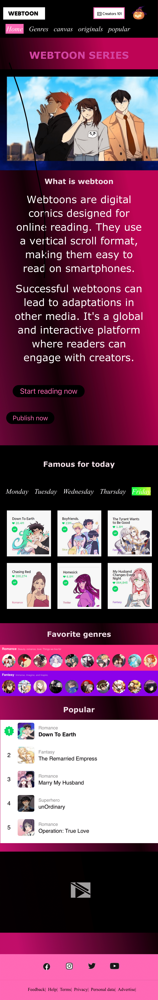
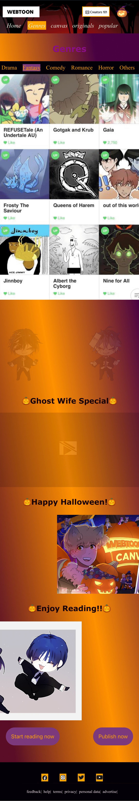

# Procesverslag
Markdown is een simpele manier om HTML te schrijven.  
Markdown cheat cheet: [Hulp bij het schrijven van Markdown](https://github.com/adam-p/markdown-here/wiki/Markdown-Cheatsheet).

Nb. De standaardstructuur en de spartaanse opmaak van de README.md zijn helemaal prima. Het gaat om de inhoud van je procesverslag. Besteedt de tijd voor pracht en praal aan je website.

Nb. Door *open* toe te voegen aan een *details* element kun je deze standaard open zetten. Fijn om dat steeds voor de relevante stuk(ken) te doen.

## Jij

  
uitwerken voor kick-off werkgroep

  ### Auteur:
  Marina Awan (vervangen door jouw naam)

  #### Je startniveau:
  blauw (kies uit zwart, rood óf blauw)

  #### Je focus:
  surface plane (kies uit responsive óf surface plane)
 

## Je website

  
uitwerken voor kick-off werkgroep

  ### Je opdracht:
  link naar de website die je gaat namaken óf de naam/omschrijving van je eigen ontwerp
  https://marinawan03.github.io/webtoon/ 

  #### Screenshot(s) van de eerste pagina (small screen): 
  hier de naam van de pagina  
  

  #### Screenshot(s) van de tweede pagina (small screen):
  hier de naam van de pagina  
 
 

## Toegankelijkheidstest 1/2 (week 1)

  
uitwerken na test in 2e werkgroep

  bij de toegankelijkheidstest ging ik de website van mijn duopartner bekijken en ook mijn eigen website. 
  daaruit kon ik bepaalde punten eruit halen van beide websites
  

  ### Bevindingen
  Lijst met je bevindingen die in de test naar voren kwamen:

  mijn website:
  - het leest niet alles voor, waarbij je tab moet aanklikken
  - het begint wel via de header en benoemt wel de juiste informatie
  - bij sommige onderdelen wordt het verkeerd besproken, bijvoorbeeld 3m (3 miljoen), wordt uitgesproken als 3 meter.
  - screenreaders zijn handig maar ze werken niet helemaal perfect op de website.

    website van mijn duopartner:
    - de navigatie van de screenreader werkt niet op goede volgorde
    - om naar de volgende te gaan moet je op tab klikken en spatiebalk wat niet echt handig is
    - met spraak is het wel goed 

## Breakdownschets (week 1)

  
uitwerken na afloop 3e werkgroep

  ### de hele pagina: 
  

  ### dynamisch deel (bijv menu): 
  

  ### wellicht nog een dynamisch deel (bijv filter): 
  

## Voortgang 1 (week 2)

  
uitwerken voor 1e voortgang

  ### Stand van zaken
  hier dit ging goed & dit was lastig (neem ook screenshots op van delen van je website en code)
  

  de navigatiebalk ging goed en ik had een manier gevonden om het te hoveren 

  

  ik had in de body een background gemaakt met, linear-gradient, maar op het scherm als je het op een kleine formaat doet is het niet helemaal gevuld
  

  ik heb nog moeite met het css in de nth-of-type en de rest aan de hand van ul en li verder het zoeken naar een bepaalde image waarbij een gedeelte word geselecteerd.

  

  ### Agenda voor meeting
  samen met je groepje opstellen

  | Max      | Ebru       | Robin     | Niels      |

  ### Verslag van meeting
  Robin wou vooral vragen stellen over het opstellen van een responsiveness website en nog ook de header te fixen. Max had persoonlijke vragen rond het mondeling. Niels ging vooral vragen
  stellen over een invulformulier met input-type. Ebru en ik wouden beide vragen of onze code vooral netjes is. Mijn probleem was ook dat mijn pagina ging overlopen over mijn pagina. En ook mijn section bekijken.

  - punt 1: persoonlijke vragen over de grootte van een website
  - punt 2 kijken hoe je nth of type moet doen
  - piunt 3 section en articles op een goede plek zetten
    

## Voortgang 2 (week 3)

  
uitwerken voor 2e voortgang

  ### Stand van zaken
  Het ging goed met het plaatsen van een nav dat lukte me wel met display flex en het positioneren daarvan. Ook van het geven van een animatie aan een afbeelding. De mogelijkheid om op iets te klikken en
  dan laten verschijnen
  

het ging vooral fout later waarbij er een groot witruimte tussen zat en ik de probleem niet kon vinden. Later was het ook dat ik dat probleem had gefixt, maar kwam met een andere, zoals dat 
er in plaats van 1 ding alles werdt geselecteerd. 

dit is een afbeelding van waar het mis ging.

de code die ik had voor de witruimtes en selecties.

  ### Agenda voor meeting
  samen met je groepje opstellen

 | Max      | Ebru       | Robin     | Niels      |

 we hadden geen vragen echt, meer iets persoonlijk over onze code die netjes moest zijn. Robin was niet aanwezig in het gesprek.

  ### Verslag van meeting
  hier na afloop snel de uitkomsten van de meeting vastleggen

  - punt 1 kijken en letten dat je in plaats van px , em gaat doen
  - punt 2 je website is nog niet responsive, waarbij ik ga kijken of ik dat nog kon doen.

## Toegankelijkheidstest 2/2 (week 4)

  
uitwerken na test in 9e werkgroep

  ### Bevindingen
  Lijst met je bevindingen die in de test naar voren kwamen (geef ook aan wat er verbeterd is):
  de verbetering dat vooral er is, is dat mijn pagina de optie heeft om naar dark-modus en light-modus te gaan. Bepaalde content laten zien dat je niet op de website normaal ziet staan. Verder moet er nog gewerkt worden aan de Alt teksten voor de screenreader. Het oefenen kan daarbij dus beter.

mijn website

 - ik heb een darkmodus
 - screenreader is duidelijker maar kan nog beter
 - niet veel content dat overbodig is

   kenza's website

- screenreader werkt wel
- moeilijk te zien waar je kan volgen. 

 

## Voortgang 3 (week 4)

  
uitwerken voor 3e voortgang

  ### Stand van zaken

animaties die ik dacht die niet gingen werken, waarbij ik eigenlijk alleen nog de duration moest veranderen. 

  

  ### Agenda voor meeting
  samen met je groepje opstellen

 | Max      | Ebru       | Robin     | Niels      |

  ### Verslag van meeting
  hier na afloop snel de uitkomsten van de meeting vastleggen

  - punt 1 max-with niet gebruiken en veranderen
  - punt 2 gebruik geen bottom, maar margin-top 0 
  - input valid leren en nog meer
  - values leren zoals van verschillende states

## Eindgesprek (week 5)

  
uitwerken voor eindgesprek

  ### Je uitkomst - karakteristiek screenshots:
  
  

  ### Dit ging goed/Heb ik geleerd: 
  Korte omschrijving met plaatjes
  het toevoegen van animaties ging goed bij mij vooral, daar kon ik beter mee werken.
  Ook ging het goed met het toevoegen van dark modes

  

  

  ### Dit was lastig/Is niet gelukt:
  Korte omschrijving met plaatjes

  
  het vinden van de juiste nth-of-type of selectie van een bepaalde image,content,text

## Bronnenlijst

  
continu bijhouden terwijl je werkt

  Nb. Wees specifiek ('css-tricks' als bron is bijv. niet specifiek genoeg). 
  Nb. ChatGpT en andere AI horen er ook bij.
  Nb. Vermeld de bronnen ook in je code.

1. https://www.w3schools.com/css/css_dropdowns.asp  het positioneren van bepaalde content
2. https://chat.openai.com/c/94c33977-aa0d-4ffd-bf0e-f2d308fea5be sommige vragen stellen over de javascript code en of het klopt af en toe waar naar ik zoek
3. https://www.quackit.com/css/codes/marquees/create_fly-in_text_in_css.cfm animaties voor een tekst
4. https://www.tutorialspoint.com/css/css_animation_fade_in_left.htm animaties van een fade-in
5. https://codepen.io/P1N2O/pen/pyBNzX animatie voor het draaien
6. https://www.youtube.com/watch?v=045j86hondk song voor de audio
7. https://developer.mozilla.org/en-US/docs/Web/CSS/CSS_Animations/Using_CSS_animations gradient voor de tekst 

